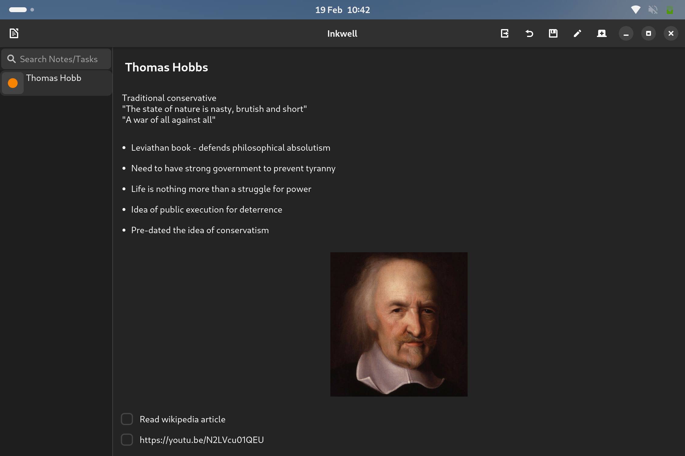

# Inkwell

[](https://github.com/Wemmy0/Inkwell/actions/workflows/pylint.yml)

A minimalistic rich text notes app written in GTK4 and Python

### Running from source (Fedora):
1. Clone repo using Github CLI
```
gh repo clone Wemmy0/Inkwell
```

2. Create new venv & activate it
```
python -m venv ./venv
source ./venv/bin/activate
```

3. Install the required dependancies
```
dnf install gobject-introspection-devel
pip install PyGObject mysql-connector-python openai pycairo requests
```

 4. Start Inkwell
```
python src/main.py
```
